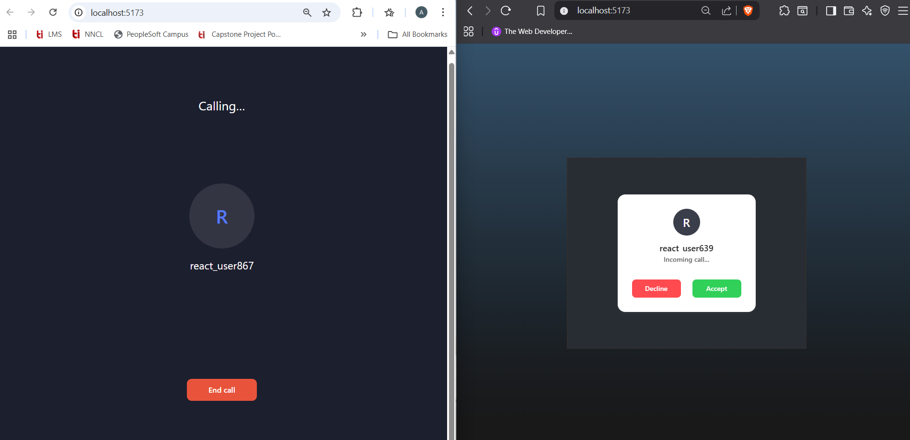

## ​ ZegoTalk

A sleek **real-time voice & video calling app** built with **React**, **Vite**, and **ZEGOCLOUD**. Ideal for showcasing your engineering skills in building modern web communication applications.

---

##  Key Features

-  Real-time **Voice & Video Calling** with invitation-style initiation
-  Secure usage of environment variables for production-safe API keys
-  Built with **Vite** for lightning-fast builds and **Tailwind CSS** for clean, responsive UI
-  Uses **ZegoUIKitPrebuilt** with plugin support (`ZIM`) for simplified call flows
-  Optional token server architecture for secure deployment (briefly explained)

---

## Demo Screenshots

  
  

